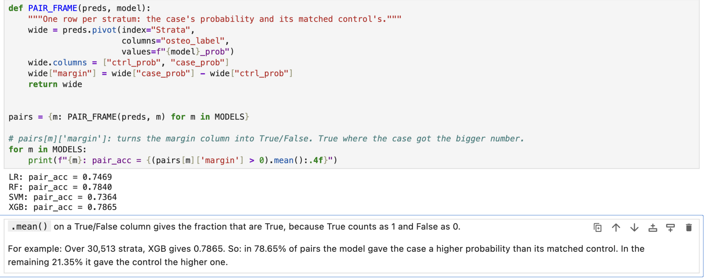
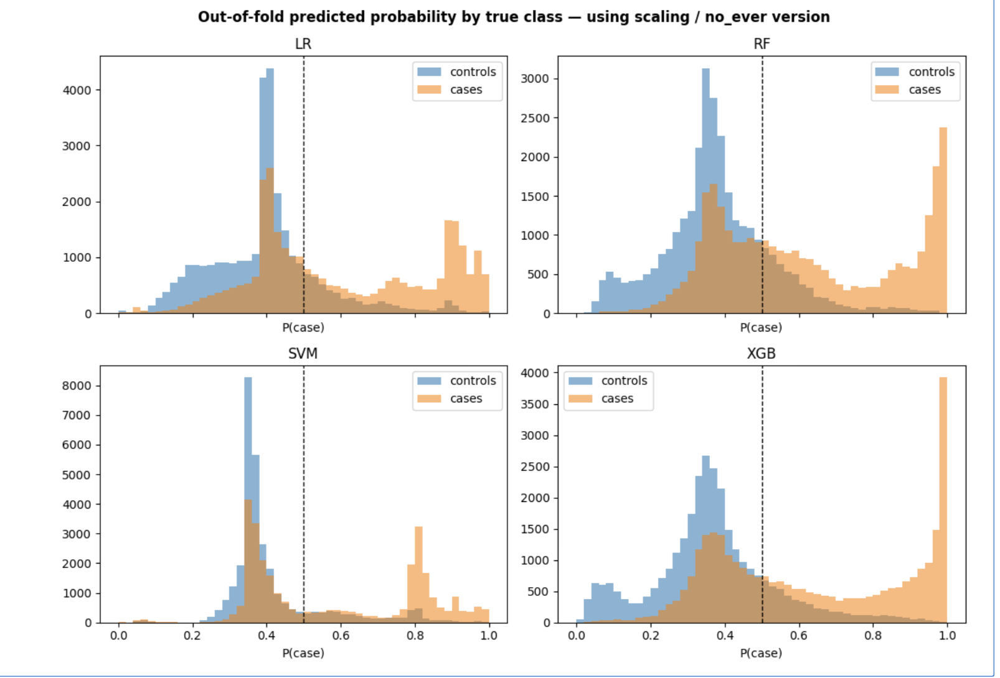
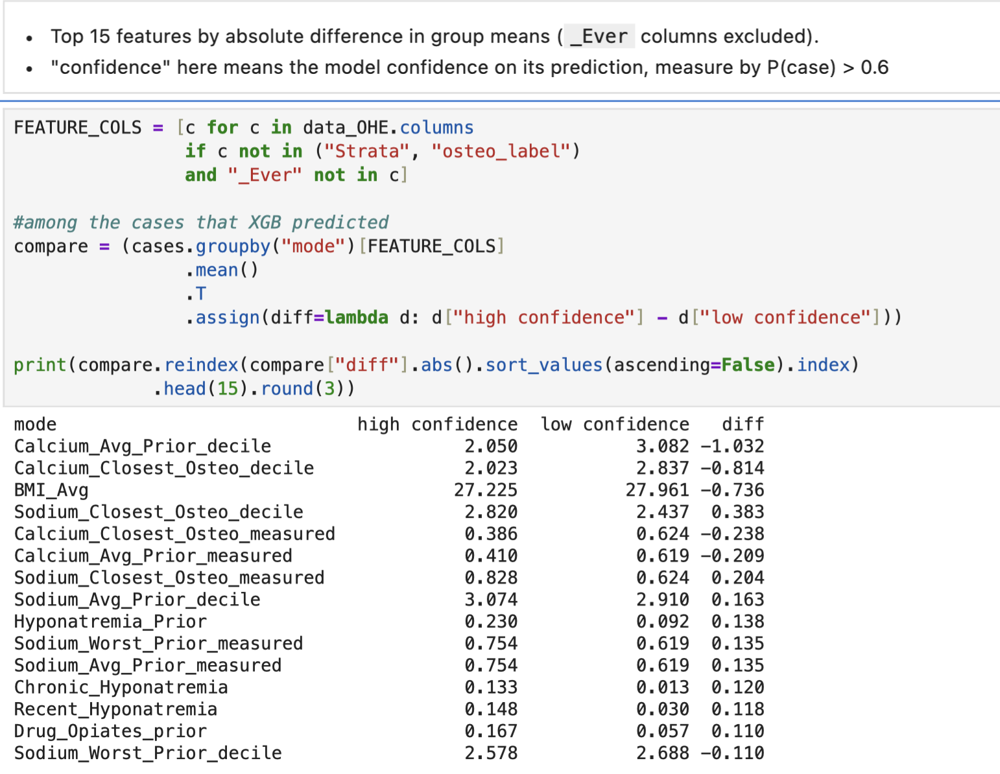

# 1. Pairwise ranking
This evaluation measures pairwise ranking accuracy (or matched pair accuracy), which tests how often each model correctly assigns a higher predicted probability to a case compared to its matched control within the same stratum.

Another name is `Direct Pairwise Concordance` ($C$-Index): For 1:1 matched pairs, the pair_acc metric is mathematically equivalent to the conditional area under the ROC curve (or **concordance index**). 

**Key Takeaways**

* **XGBoost achieves the top performance:** XGB leads all models with the highest pairwise accuracy of 0.7865.   

* **Tree-based models lead overall:** XGB (0.7865) and RF (0.7840) demonstrate the strongest ranking ability, closely followed by the ANN (0.7736).   

* **Tree ensembles and Neural Networks outperform linear/margin models:** Both tree-based approaches (XGB, RF) and the feed-forward neural network (ANN) noticeably outperform the linear/margin-based baseline models, LR (0.7469) and SVM (0.7364).   

* **SVM shows the lowest accuracy:** SVM yields the lowest pairwise ranking accuracy among all five candidates at 0.7364. 

Interpretation of Metric: Because this metric explicitly evaluates within-stratum ranking, it directly mirrors the pairwise concordance probability (equivalent to the Area Under the ROC Curve evaluated within matched pairs). A score of 0.5000 would indicate random guessing, so all models demonstrate substantial predictive power above baseline.

**Conclusions**
Model Selection: Gradient Boosting (XGB) or Random Forest (RF) should be prioritized for tuning, as tree ensembles better capture the underlying structure of this matched dataset.

Pairwise Separation: All models demonstrate strong discriminative capacity well above baseline (>73%), confirming that model-predicted risk scores reliably distinguish cases from matched controls within the same stratum.

---
# 2. Probability distribution by true class

## Confusion matrices at the 0.5 cutoff

| Model | TP | FN | TN | FP | Case recall | Control recall | Gap |
| --- | ---: | ---: | ---: | ---: | ---: | ---: | ---: |
| Logistic regression | 16,546 | 13,967 | 25,325 | 5,188 | 0.5423 | 0.8300 | 0.288 |
| Random forest | 18,267 | 12,246 | 25,150 | 5,363 | 0.5987 | 0.8242 | 0.226 |
| Linear SVM | 15,625 | 14,888 | 25,576 | 4,937 | 0.5121 | 0.8382 | 0.326 |
| XGBoost | 18,086 | 12,427 | 25,345 | 5,168 | 0.5927 | 0.8306 | 0.238 |
| Feed-forward ANN | 18,088 | 12,425 | 24,898 | 5,615 | 0.5928 | 0.8160 | 0.223 |

Each row totals 30,513 cases and 30,513 controls.

**Key findings**

- **Universal Case Bimodality with Varying Sharpness:**
  - All five models exhibit a bimodal case distribution (orange), separating true cases into an upper high-risk tier and a lower tier that overlaps with controls.
  - Non-linear models (**RF, XGB, and ANN**) isolate the high-risk group more sharply, correctly classifying **18,086 to 18,267** true cases at the threshold. Linear and kernel models (**LR and SVM**) struggle to push cases to high probabilities, catching only **15,625 to 16,546** true cases.

- **ANN Matches Tree Sensitivity but Sacrifices Specificity:**
  - **ANN vs. XGB:** The ANN recovers virtually the same number of true cases as XGB (**18,088** vs. **18,086**), but incurs **447 additional false positives** (5,615 vs. 5,168). This drops control recall from $83.06\%$ (XGB) to $81.60\%$ (ANN).
  - Visually, while ANN creates a strong upper peak near $P \approx 1.0$, it is lower and broader than XGB's sharp density spike.

- **Linear & Kernel Models (LR & SVM) Compress Case Risk:**
  - **LR** exhibits a heavy case-control overlap around $P \approx 0.35\text{--}0.40$ with only a weak upper peak near $0.90$.
  - **SVM** shows severe compression near $P \approx 0.35\text{--}0.40$ and a secondary spike around $0.80$, failing to establish a smooth risk gradient.

- **Control Group Behavior Across Architectures:**
  - Controls (blue) remain concentrated below $P = 0.50$ across all models, with the primary mode centered near $P \approx 0.35$.
  - **XGB** stands out by pulling a distinct sub-population of low-risk controls into a secondary peak below $P \approx 0.15$ (with a visible dip around $0.15\text{--}0.18$), a pattern seen only as a subtle shoulder in RF and ANN.

- **Persistent Overlap Zone (Low-Confidence Region):**
  - Across all five models, the region between $P \approx 0.30$ and $P \approx 0.50$ represents a heavily overlapping, low-confidence zone. 
  

**Takeaway**

All five models produce a bimodal case distribution, so the split into a high-risk group and a
group overlapping the controls is not specific to tree structure — the ANN, which does not
split on features, shows the same shape. 

The models differ in how sharply they separate the
two, and in whether they buy case capture at the cost of control recall. None was tuned. The
overlap region persists in every model, which is what sections 3 and 4 investigate.

---
# 3. Two groups of cases: highlighting the features that drive strong model certainty

This analysis compares true cases that XGBoost scored at or above $P(\text{case}) = 0.6$ against those it scored below, and asks how the two groups differ. Section 6 of notebook 07 repeats this comparison for the ANN.

### Primary Insights

* **Hyponatremia flags separate the two groups:**
  * `Chronic_Hyponatremia` (13.3% vs. 1.3%) and `Recent_Hyponatremia` (14.8% vs. 3.0%) are roughly 5 to 10 times more common in the high-confidence group.
  * `Hyponatremia_Prior` follows the same direction (0.230 vs. 0.092).

* **Opiate use and BMI:**
  * Prior opiate exposure (`Drug_Opiates_prior`: 16.7% vs. 5.7%) is about 3x higher in the high-confidence group.
  * `BMI_Avg` is slightly lower (27.2 vs. 28.0).

* **Measurement flags show strong divergence:**
  * Sodium is measured more often in the high-confidence group (`Sodium_Closest_Osteo_measured`: 0.828 vs. 0.624), whereas calcium is measured less often (`Calcium_Closest_Osteo_measured`: 0.386 vs. 0.624). Sections 4.4 and 5 examine these lab-missingness patterns in detail.

* **The ANN splits the same cases:**
  * 93.2% of cases fall into the same confidence group under both models, and their probability rankings correlate at 0.953 (Spearman). The feature differences match XGBoost's in direction and magnitude throughout, demonstrating that this split is not an artifact of a single algorithm.

### Methodological Notes

* **Direction of the comparison:** Groups are defined by model outputs; these features distinguish cases the model scores highly, rather than proving a direct causal relationship.
* **Univariate only:** Comparisons reflect group means one column at a time. Features are correlated, and hyponatremia flags derive from the same sodium draws as the measurement flags.

---
# 4. Informative missingness / ascertainment bias

Missing labs are coded as decile 0 (notebook 07, section 4.4.A), so the raw decile columns mix
"no draw" with "low value". This section separates the two.

**Which labs were ordered differs between the two case groups (4.4).** 

Calcium is measured less often in high-confidence cases, and sodium more often. Among cases who had a sodium draw, the values also run lower and more variable. Calcium is mixed: `Calcium_Avg_Prior` shows no difference once missingness is removed, while
`Calcium_Closest_Osteo` runs slightly higher in the high-confidence group.

To be specific: calcium is measured less
often in high-confidence cases (`Calcium_Closest_Osteo_measured` 38.6% vs. 62.4%;
`Calcium_Avg_Prior_measured` 41.0% vs. 61.9%) and sodium more often
(`Sodium_Closest_Osteo_measured` 82.8% vs. 62.4%). The low-confidence group sits at 0.619–0.624
on all five flags; the high-confidence column ranges from 0.386 to 0.828.

**The calcium decile gap is missingness, not physiology (4.4.A, 4.5, 4.6).** Among cases with an
actual draw, the `Calcium_Avg_Prior_decile` gap collapses from −1.032 to +0.026, and two other
decile columns reverse sign. Raw calcium is 9.13 (high) vs. 9.10 (low).

**Sodium does differ among those tested (4.5, 4.6).** All three sodium deciles are lower in the
high-confidence group ( see the gap in 4.5: from −0.498 to −0.920). `Sodium_Worst_Prior` is 136.37 vs. 137.81 mmol/L (numbers derived from section 4.6), with SD 11.24 vs. 4.49 — the wider spread, including the low values, sits in the high-confidence group.

--> All three sodium deciles are lower in the
high-confidence group, and the raw values are lower and more variable. That is a value
difference, not a coding artifact.

* **Connection to the study** The source paper is about chronic hyponatremia and osteoporosis. Low, variable sodium in the confident group is the same signal as the hyponatremia flags in section 3 (13.3% vs. 1.3%). So the cases the models identify are, in part, the hyponatremia cases — consistent with the published odds ratio of 3.97 

---
# 5. Missingness is within-class, not between-class

This section investigates whether missingness in lab measurements is a between-class effect (cases vs. controls) or a within-class effect (high-confidence cases vs. low-confidence cases),

| Flag | Between (cases − controls) | Within XGB (high − low) | Within ANN (high − low) |
| --- | ---: | ---: | ---: |
| `Calcium_Avg_Prior_measured` | −0.134 | −0.209 | −0.249 |
| `Calcium_Closest_Osteo_measured` | −0.151 | −0.238 | −0.278 |
| `Sodium_Avg_Prior_measured` | +0.022 | +0.135 | +0.104 |
| `Sodium_Closest_Osteo_measured` | +0.052 | +0.204 | +0.178 |
| `Sodium_Worst_Prior_measured` | +0.022 | +0.135 | +0.104 |

Every flag has the same sign in all three columns, and every within-class gap exceeds its
between-class gap. The ANN column reproduces XGBoost's, so the pattern is not specific to one
algorithm.

* **Missingness is Primarily a Within-Class Phenomenon**: The gaps in measurement rates across confidence subgroups within true cases—0.135 to 0.238 for XGBoost (Section 5.2) and 0.104 to 0.278 for the ANN (Section 6.12)—are consistently larger than the overall between-class gaps between cases and controls (0.022 to 0.151 in Section 5.1). 
 
* **Impact of Missingness & Feature Weight:** Missingness patterns drives how models separate high-confidence cases from low-confidence cases, rather than just separating cases from controls. However, observed univariate disparities between groups should not be confused with feature importance, as features can exhibit group-level differences without driving model outputs.
 
* **Testing Frequencies Vary by Test, Not a Blanket Increase**: True cases are not uniformly tested more often. For example, calcium is ordered less frequently in cases than in controls (0.51 vs. 0.66), while sodium shows only a modest increase (0.72 vs. 0.67). Numbers derived from section 5.1, the `between` table
* **High Within-Class Variance in High-Confidence Cases**: While low-confidence cases show a nearly uniform measurement probability across all five lab flags (0.619 to 0.624), high-confidence cases display a wide spread spanning from 0.386 to 0.828. This high feature variance within high-confidence predictions is precisely where the within-class missingness signal resides.

**Methodological caution.** Decile 0 conflates true low values with missing values, so sections
4.5–4.6 are the only clean comparison of lab values. 

**Takeaway.** The two case groups are distinguished largely by which labs were ordered, and among
those tested, by lower and more variable sodium. Cases the models miss look uniform on every
measurement flag.
